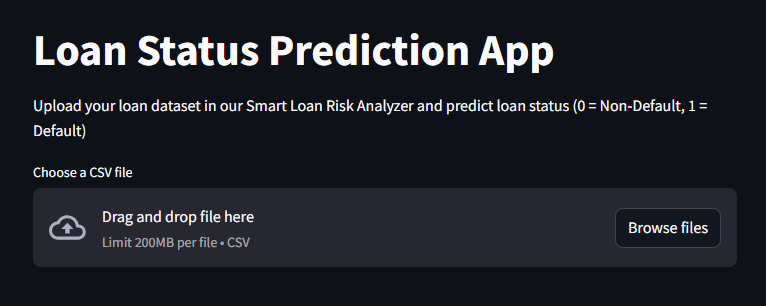
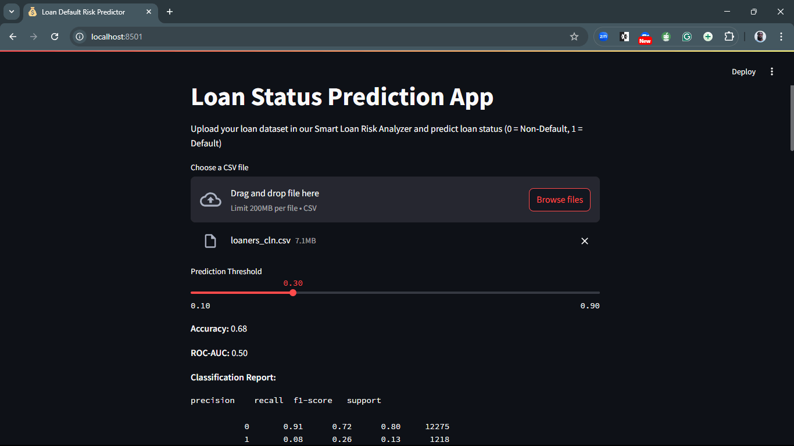
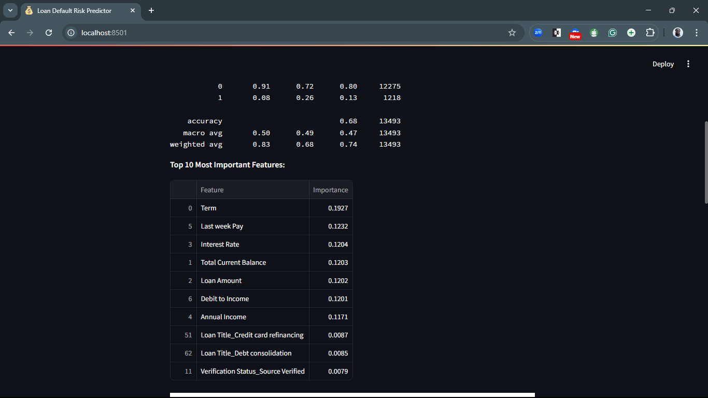
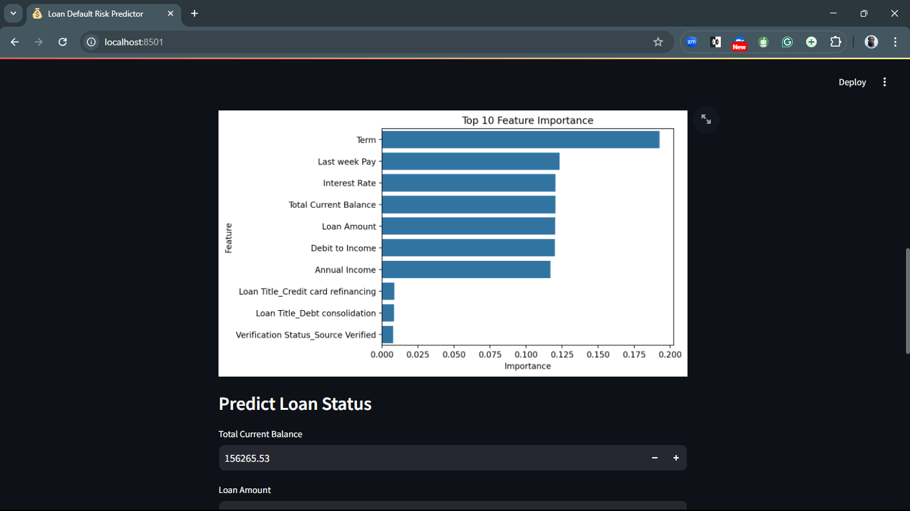
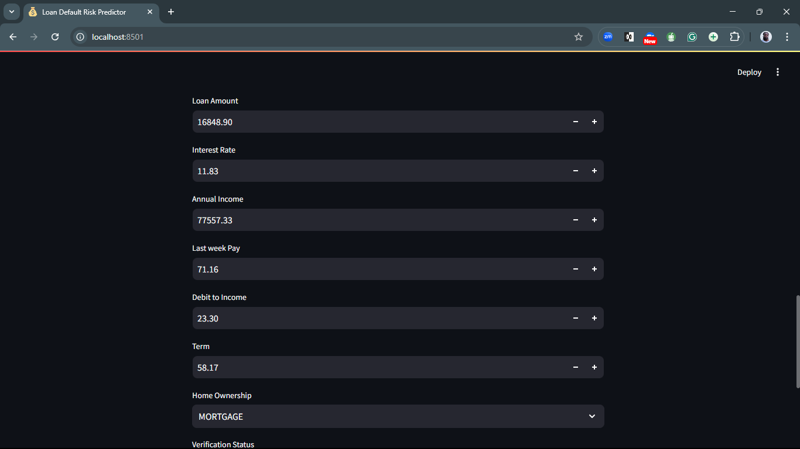
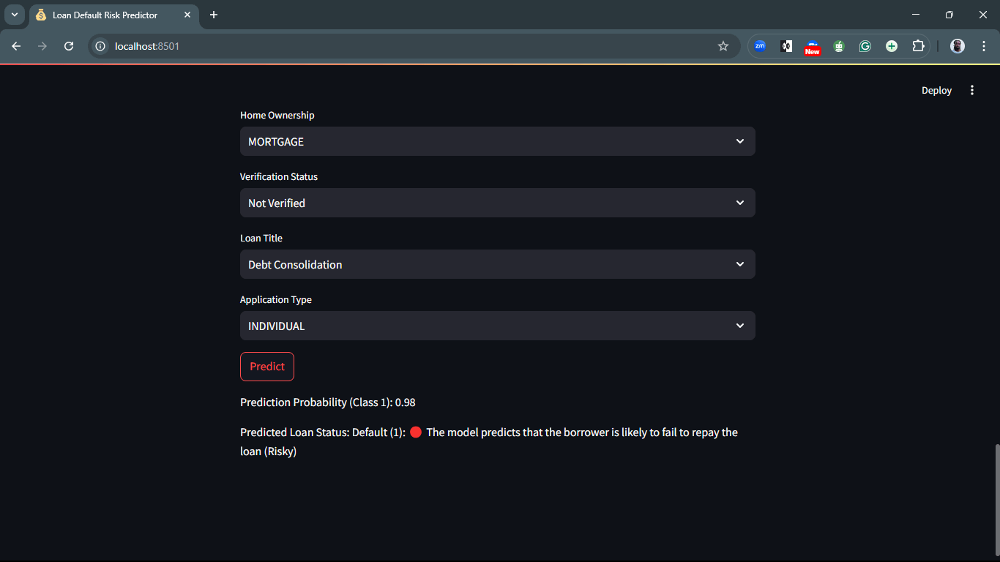

# 📊 Predicting Loan Default (Banking)


---

## 🎯 Goal
This Data Science project aims to **predict whether a customer will default on their loan** based on financial history, personal attributes, and loan details. Accurately identifying high-risk borrowers can help financial institutions minimize losses and make more informed lending decisions.

---

## 🚀 Live Demo

👉 Try the live app here: [Streamlit Web App](https://your-streamlit-app-url)

  
<sub>*Example screenshot of the app in action — replace with your own.*</sub>

---

## 🖼️ App Screenshots

### 📌 Home Page


### 📌 Data Upload Section


### 📌 Model Evaluation Metrics


### 📌 Feature Importance Graph


### 📌 Prediction Interface


---

## 📁 Project Structure

The project is organized into five key tasks:

---

### ✅ Task 1: Project Introduction and Data Collection
**Objective:** Understand the problem and obtain the dataset.

- Define the problem statement and importance.
- Explain the dataset (features and target variable).
- Download and load the dataset into a Jupyter Notebook.

**Tools:** `Python`, `Jupyter Notebook`, `pandas`

```py
import pandas as pd 
# Load dataset 
df = pd.read_csv('dataset.csv') 
# Display first few rows 
df.head() 
```

---

### 🔍 Task 2: Data Exploration and Cleaning
**Objective:** Perform Exploratory Data Analysis (EDA) and clean the dataset.

- Check for missing values, outliers, and incorrect data types.
- Handle missing values (impute or drop).
- Identify and visualize key patterns using `matplotlib` and `seaborn`.

```py
import matplotlib.pyplot as plt 
import seaborn as sns 
 
# Check for missing values 
print(df.isnull().sum()) 
 
# Visualize numerical distributions 
df.hist(figsize=(10, 5)) 
plt.show() 
```

---

### 🛠️ Task 3: Feature Engineering and Selection
**Objective:** Create new features and remove irrelevant ones.

- Create meaningful features (e.g., ‘total spending per year’).
- Perform feature selection (correlation analysis, VIF, chi-square test).
- Encode categorical variables (one-hot encoding, label encoding).
- Split data into training and testing sets (80-20 split).

```py
from sklearn.model_selection import train_test_split 
 
X = df.drop(columns=['target'])  # Features 
y = df['target']  # Target variable 
 
X_train, X_test, y_train, y_test = train_test_split(X, y, test_size=0.2, random_state=42) 
```

---

### 🤖 Task 4: Model Building
**Objective:** Train a machine learning model.

- Choose an appropriate model (Logistic Regression, Decision Trees, Random Forest, etc.).
- Train the model on the training dataset.
- Make predictions on the test dataset.

```py
from sklearn.ensemble import RandomForestClassifier 
 
# Train model 
model = RandomForestClassifier(n_estimators=100, random_state=42) 
model.fit(X_train, y_train) 
 
# Predict on test set 
y_pred = model.predict(X_test) 
```

---

### 📈 Task 5: Model Evaluation and Reporting
**Objective:** Evaluate model performance and prepare a final report.

- Evaluate the model using accuracy, precision, recall, F1-score, and confusion matrix.
- Write a final report explaining key findings.
- Push the project to [GitHub](https://github.com/).

**Bonus:** Deploy the model using `Flask` or `Streamlit`.

```py
from sklearn.metrics import accuracy_score, precision_score, recall_score, f1_score 
accuracy = accuracy_score(y_test, y_pred) 
precision = precision_score(y_test, y_pred, pos_label='Yes') 
recall = recall_score(y_test, y_pred, pos_label='Yes') 
f1 = f1_score(y_test, y_pred, pos_label='Yes') 
print(f'Accuracy: {accuracy:.2f}') 
print(f'Precision: {precision:.2f}') 
print(f'Recall: {recall:.2f}') 
print(f'F1 Score: {f1:.2f}') 
```

---

## 🧪 Tech Stack & Libraries

- Python 3.12
- pandas
- NumPy
- scikit-learn
- imbalanced-learn
- matplotlib
- seaborn
- Streamlit

---

## ⚙️ Setup Instructions

To run the project locally:

1. **Clone the repository:**

```bash
git clone https://github.com/princenzmw/Load_Default_Prediction.git
cd Load_Default_Prediction
```

2. **Create a virtual environment (optional but recommended):**

```bash
python -m venv venv
source venv/bin/activate   # On Windows: venv\\Scripts\\activate
```

3. **Install dependencies:**

```bash
pip install -r requirements.txt
```

4. **Run the Streamlit app:**

```bash
streamlit run app.py
```

---

## 👥 AUTHORS:
- [Siena](https://github.com/Siena-aa)
- [Dorothy](https://github.com/Dorothy254)
- [Withney](https://github.com/whitney-tech018)
- [Ezekiel Niyomwungere](https://github.com/Ezekiel-Niyomwungere)
- [Prince NZAMUWE](https://github.com/princenzmw)
- [Kevin Maina](https://github.com/quatroze)

## 📄 License

This project is licensed under the [MIT License](LICENSE).

---

## 💬 Feedback

Feel free to open issues or submit pull requests. Contributions are welcome!